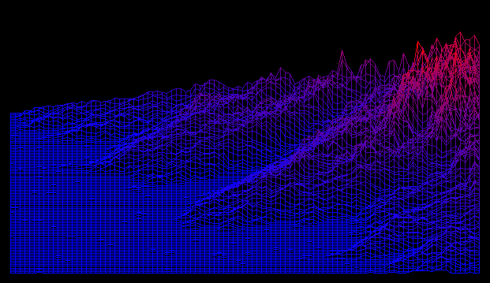
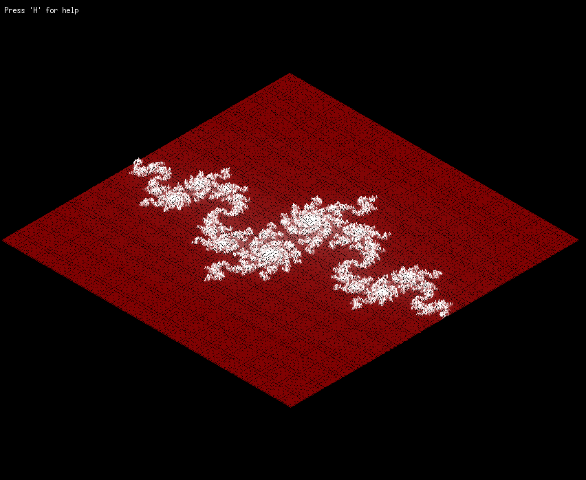
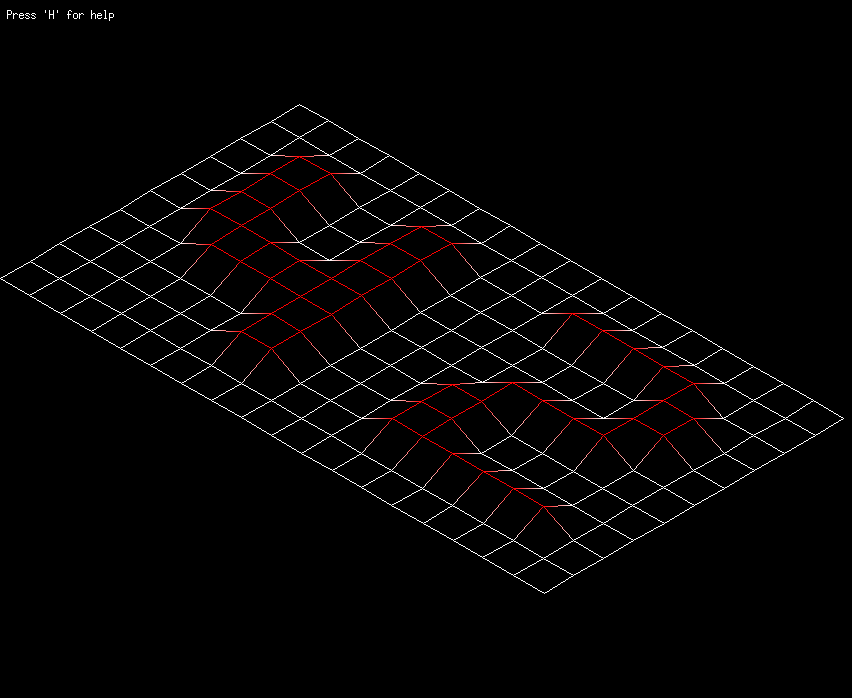

# FDF

<p align="center">
  
</p>

## Description
This project focuses on creating a 3D wireframe model using the MiniLibX graphical library. 
The program allows for the visualization of landscapes from 2D representation inputs, by connecting points in 3D space with line segments.
The [Bresenham algorithm](https://en.wikipedia.org/wiki/Bresenham%27s_line_algorithm) is employed for line drawing, and [rotation matrices](https://en.wikipedia.org/wiki/Rotation_matrix) are applied to handle rotations.

<p align="center">
  
</p>

## Features

Color: 
- Reads color from input maps
- Creates gradient in case of no input
- Users can change colors.

Rotation and Translation:
- Rotate and translate the 3D wireframe model
- Continuous rotation

Zoom and altitude scale:
- Adjust the scale using zoom
- Use -/+ keys to increase the altitude factor

Help Menu
- User-friendly set of instructions 

## Installation and Usage intructions
1. Clone the repository:
    ```sh
    git clone https://github.com/daviduartecf/fdf.git
    ```
2. Compile the project:
    ```sh
    make
    ```
3. Run the executable:
    ```sh
    ./fdf test_maps/<name of the map>.fdf
    ```
    Use any map inside the 'test_maps/' directory.


